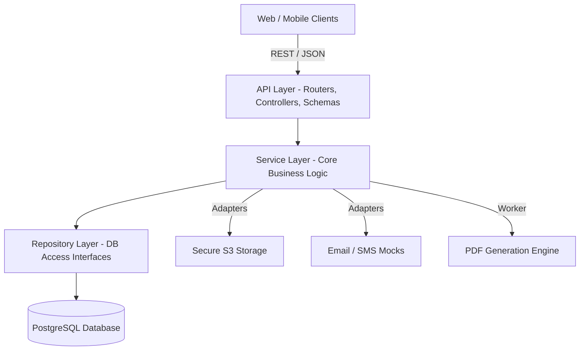
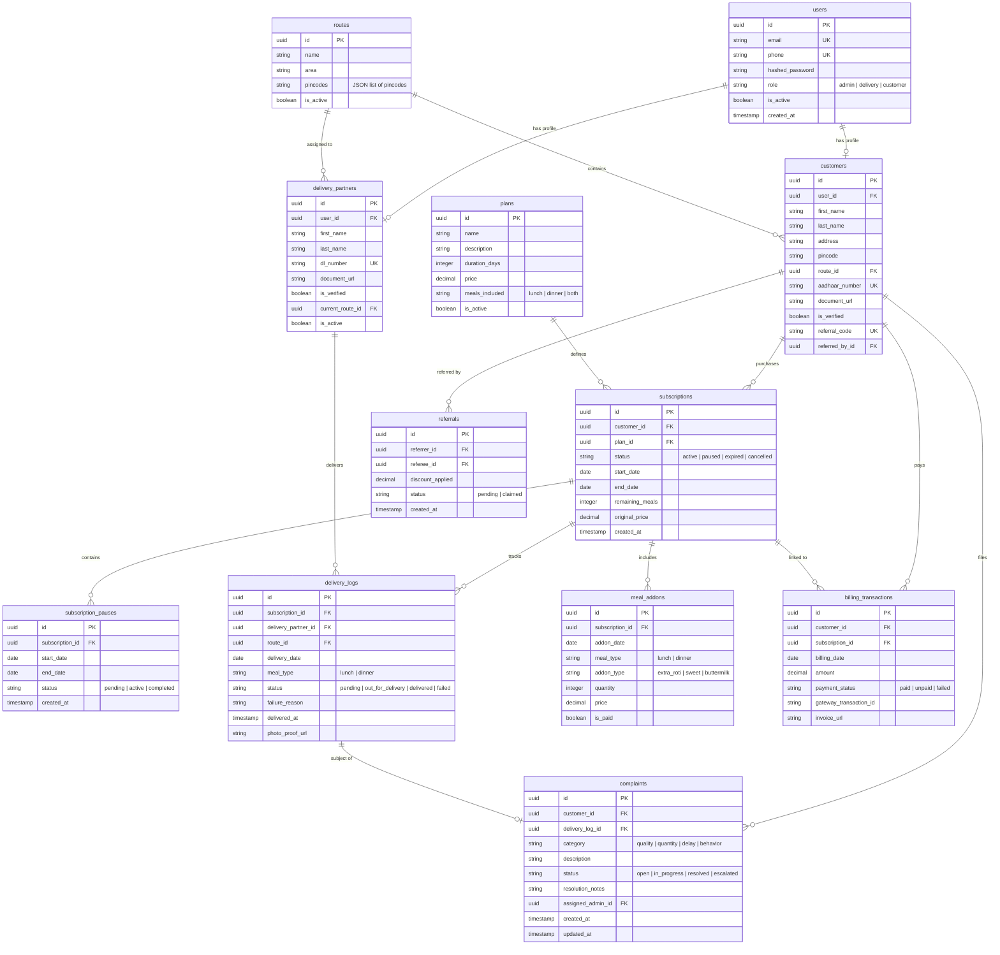

# Saanjh Ki Roti - Project Requirements & Technical Implementation Plan

This document serves as the master specification, architecture blueprint, and execution roadmap for the **Saanjh Ki Roti** tiffin subscription and delivery management backend.

---

## Step 1 — Requirement Analysis

### 1. Functional Requirements
*   **Customer Management**:
    *   Registration with email, phone number, and address.
    *   Aadhaar document upload for verification (Kota student housing security policy compliance).
    *   Address geo-tagging or route mapping based on pin codes.
    *   Customer profile dashboard displaying current subscription status, history, and active pauses.
*   **Subscription Management**:
    *   Three plan types: Daily, Weekly, Monthly.
    *   Meal inclusions: Lunch, Dinner, or Both.
    *   Subscription states: `Pending Payment`, `Active`, `Paused`, `Expired`, `Cancelled`.
    *   Automatic renewal notifications 3 days before expiration.
*   **Pause & Resume Mechanism**:
    *   Customers can pause subscriptions.
    *   Cut-off times enforced:
        *   Lunch pause request: Must be submitted before **08:00 AM** on the target day.
        *   Dinner pause request: Must be submitted before **04:00 PM** on the target day.
    *   Pauses extend the subscription duration by the corresponding number of meals.
*   **Meal Add-ons**:
    *   Customers can request extra items (e.g., extra rotis, curd, sweets) on top of their scheduled meal.
    *   Subject to the same cutoff times as pauses (08:00 AM for lunch, 04:00 PM for dinner).
    *   Charged immediately via payment link or aggregated in the monthly statement.
*   **Delivery Route Management**:
    *   Admins define routes based on pin codes and areas.
    *   Admins assign delivery partners to routes.
    *   System generates daily delivery logs for each route.
*   **Delivery Status Tracking**:
    *   Delivery partners view their daily route sheet via their portal.
    *   Partners mark delivery status: `Pending`, `Out For Delivery`, `Delivered`, `Failed`.
    *   If `Delivered`, optional photo proof upload or verification PIN.
    *   If `Failed`, selection of a reason (e.g., *Customer Unreachable*, *Door Locked*, *Refused*).
*   **Billing & Payments**:
    *   Prepaid models for subscriptions.
    *   System records invoices and transactions.
    *   Postpaid/aggregated billing ledger for add-ons.
    *   Integration of webhooks to process payment success/failure.
*   **Referral Discounts**:
    *   Unique referral code generated for every customer upon verification.
    *   If referee signs up using the code, both receive a promotional credit.
    *   Credit unlocks only after the referee's first monthly subscription plan transitions to `Active` and completes 30 days.
*   **Complaint Management**:
    *   Customers log complaints (e.g., *Late Delivery*, *Spilled Food*, *Poor Quality*).
    *   Complaints are linked to specific delivery runs.
    *   Admins triage complaints and apply resolutions (e.g., *Refund*, *Free Meal Credit*, *Warning to Partner*).
    *   Escalation: Unresolved complaints escalate to Tier 2 after 24 hours.
*   **Document Upload**:
    *   Secure S3-compatible file storage.
    *   Aadhaar card upload for customers; Driving License (DL) upload for delivery partners.
*   **Notification System**:
    *   Asynchronous event-driven notifications (SMS, Email, Push).
    *   Dispatched for subscription activation, daily delivery departure, delivery completion, pause confirmations, payment failures, and complaint resolutions.
*   **Admin Dashboard & Reporting**:
    *   Real-time counters for active subscriptions, ongoing deliveries, kitchen meal prep counts (Lunch vs. Dinner counts for the day).
    *   Automated monthly PDF report generation containing operational metrics, revenue, complaints, and delivery efficiency.

### 2. Non-Functional Requirements
*   **Performance**: Core API response times `< 200ms` (95th percentile). Daily route calculation and delivery run creation completed within 2 minutes.
*   **Security**:
    *   BCrypt password hashing.
    *   JWT-based authentication (OAuth2 Password flow).
    *   Role-Based Access Control (RBAC) with scopes: `admin`, `delivery`, `customer`.
    *   Secure signed URLs for document downloads.
*   **Scalability**: Stateless service design allowing scale-out. Database indexes optimized on foreign keys and frequently searched attributes (e.g., `phone`, `email`, `status`).
*   **Reliability & Availability**: Database transaction isolation. Implementation of Outbox Pattern for critical notification dispatch.
*   **Auditing & Observability**: JSON structured logging. Changes to subscriptions, routes, and billing ledger write to audit logs.

### 3. User Roles & Permissions
*   **Admin (`role:admin`)**: Full read/write access to all entities, analytics, complaints, routes, partner details, plans, and system overrides.
*   **Delivery Partner (`role:delivery`)**: Read assigned delivery logs, write status updates (Delivered/Failed), read their own profile, upload DL.
*   **Customer (`role:customer`)**: Read/write their own profile and subscriptions, toggle pauses, request add-ons, file complaints, view billing, upload Aadhaar.

---

## Step 2 — Find Missing Requirements (Things That Can Go Wrong)

A production-grade backend must handle failures gracefully. The following table identifies potential operational anomalies and specifies their programmatic mitigations:

| Anomaly / Failure Mode | Root Cause / Context | Handling & Mitigation Strategy |
| :--- | :--- | :--- |
| **Duplicate Phone / Email** | Concurrent user registrations. | Unique constraints on `users.phone` and `users.email`. Return `409 Conflict` with a user-friendly API error. |
| **Duplicate Aadhaar / DL** | Fraudulent multi-account creation. | Unique database index on `document_number`. Admin dashboard flags duplicate documents for review. |
| **Customer Reactivation** | Former customer returns after expiry/cancellation. | Verify identity, reactivate existing record, create a new subscription entity (do not overwrite historical plans). |
| **Customer Merges** | Customer registers with new phone, wants old history merged. | Admin override API: transfers subscriptions, invoices, and complaints to target user; marks source user as `merged` and soft-deletes. |
| **Subscription Overlap** | Customer buys a monthly plan while having an active weekly plan. | Prevent checkout. Enforce a rule: a customer can only have one `Active` primary plan. Allow scheduling the next plan to start on `active_plan.end_date`. |
| **Plan Price Changes** | Admin updates price of "Monthly Executive Meal" plan. | Active subscriptions remain grandfathered at their initial rate. Updates apply only to new purchases and renewals. |
| **Paused Subscriptions at Billing** | Subscription billing date occurs while paused. | Validity end date is dynamically pushed out. The database calculates remaining meals instead of fixed calendars. |
| **Billing Corrections** | Delivery failure requires refunding one meal's value. | Add a credit note transaction to the customer's wallet/ledger balance. Deduct the credit note value on the next invoice. |
| **Payment Failures** | Gateway rejects card/UPI. | Mark transaction `failed`. Keep subscription as `pending_payment`. Notify customer. Block delivery generation until payment succeeds. |
| **Partial Payments** | Split-payment anomalies or manual offline collection errors. | Record payment in ledger. Allow grace period (e.g., 2 days) before auto-suspending. Admin dashboard highlights accounts with outstanding balances. |
| **Auto Pause / Expire** | Subscription runs out of meals or passes end date. | Cron job at midnight check: marks status `Expired` if `end_date` is reached. Prevents generation of delivery logs for the day. |
| **Delivery Reassignment** | Assigned delivery boy does not check in by 09:00 AM. | Alert admin on dashboard. Admin reassigns the entire route to an available backup partner; logs update automatically. |
| **Route Changes Mid-Delivery** | Construction/road blockades. | Delivery boy updates route status. Backend permits manual reassignment of pending deliveries to adjacent routes. |
| **Delivery Partner Resignation** | Delivery staff quits. | Soft-delete/deactivate delivery staff record. Route remains active but flagged as `unassigned`. Deliveries on that route block generation until reassigned. |
| **Deleted Plans** | Admin deletes a legacy subscription plan. | Plan is soft-deleted (`is_active = false`). Active subscriptions bound to this plan continue functioning normally until expiration. |
| **Complaint Escalation** | Complaint remains open > 24 hours. | Background task changes status from `Open` to `Escalated` and sends SMS/email alerts to the Head of Operations. |
| **Complaint Reopening** | Customer is unsatisfied with complaint resolution. | Allow reopening within 48 hours of resolution. Status changes back to `InProgress`, resetting the SLA timer. |
| **Add-on After Cutoff** | Customer requests extra roti at 08:30 AM for lunch. | Reject API request with `400 Bad Request` citing cutoff breach. |
| **PDF Generation Failure** | Server out-of-memory or font error during monthly run. | PDF generation task is executed in a background worker (Celery/RQ) with automatic retries. Admin dashboard shows status `Failed` with error logs. |
| **Email Delivery Failure** | Mail server timeout. | Implementation of Outbox Pattern: notifications are stored in `notification_queue` database table. A worker polls, sends, and marks `sent`. |
| **Dashboard Cache Inconsistency** | Redis cache out of sync with DB writes. | Implement Cache-Aside pattern. Database mutations for subscriptions/complaints publish events to invalidate corresponding cache keys. |
| **Invalid Document Uploads** | User uploads malicious executable instead of PDF/JPEG. | Mime-type and magic-bytes verification in service layer. Limit file uploads to `5MB`. File is renamed to random UUID before saving. |
| **Invalid Pause Requests** | Customer tries to pause a historical date. | Validation: `start_date` for pause must be `>= tomorrow` (or `>= today` if before cutoff). |
| **Customer Changes Address** | Address changes mid-subscription. | If the new address maps to a different pincode, recalculate route assignment. Flag if new pincode is outside active service zones. |
| **Inactive Delivery Route** | Pincode is shut down due to operational limits. | Mark route `inactive`. Block new subscriptions in that pincode. Send cancellation/pause alerts to active customers in that zone. |

---

## Step 3 — System Design

### 1. High-Level Architecture
This application utilizes Clean Architecture principles. The code is decoupled from databases, frameworks, and external services via interfaces (repositories, adapters, and mailers).



### 2. Folder Structure
The workspace will follow a structured layout:

```text
app/
├── api/
│   ├── v1/
│   │   ├── auth.py
│   │   ├── users.py
│   │   ├── plans.py
│   │   ├── subscriptions.py
│   │   ├── deliveries.py
│   │   ├── billing.py
│   │   ├── complaints.py
│   │   └── analytics.py
│   └── dependencies.py
├── core/
│   ├── config.py
│   ├── security.py
│   ├── exceptions.py
│   └── logging.py
├── database/
│   ├── session.py
│   └── base.py
├── models/
│   ├── user.py
│   ├── customer.py
│   ├── delivery.py
│   ├── plan.py
│   ├── subscription.py
│   ├── billing.py
│   └── complaint.py
├── repositories/
│   ├── base.py
│   ├── user.py
│   ├── customer.py
│   ├── subscription.py
│   ├── delivery.py
│   └── billing.py
├── services/
│   ├── auth_service.py
│   ├── subscription_service.py
│   ├── delivery_service.py
│   ├── billing_service.py
│   ├── complaint_service.py
│   └── storage_service.py
├── utils/
│   ├── pdf_generator.py
│   └── notification_client.py
├── tests/
│   ├── conftest.py
│   ├── test_auth.py
│   ├── test_subscriptions.py
│   └── test_deliveries.py
└── main.py
```

### 3. Database Design & Entity Relationships

The relational model utilizes foreign key constraints, indexes on lookup parameters, and soft-delete fields for critical tracking details.



### 4. API Design Specifications
The endpoints will follow REST API standards, returning appropriate HTTP status codes and structured JSON response bodies.

#### Authentication & User Management
*   `POST /api/v1/auth/register` - Create customer user. Schema: `UserRegisterRequest`. Status: `201 Created`.
*   `POST /api/v1/auth/login` - Generate access token. Form body: `username`, `password`. Returns: `TokenResponse`.
*   `GET /api/v1/users/me` - Retrieve authenticated user profile details. Auth: Required.

#### Subscriptions & Customizations
*   `GET /api/v1/plans` - List active subscription plans.
*   `POST /api/v1/subscriptions` - Purchase plan (triggers billing transaction). Auth: `customer`.
*   `POST /api/v1/subscriptions/{id}/pause` - Schedule a subscription pause. Body: `start_date`, `end_date`. Auth: `customer`.
*   `POST /api/v1/subscriptions/{id}/resume` - Explicitly resume a subscription early. Auth: `customer`.
*   `POST /api/v1/subscriptions/{id}/addons` - Request daily meal add-on. Body: `addon_date`, `meal_type`, `addon_type`, `quantity`. Auth: `customer`.

#### Delivery Operations
*   `POST /api/v1/routes` - Create delivery route. Auth: `admin`.
*   `GET /api/v1/deliveries/daily` - Retrieve daily deliveries. Auth: `delivery` (returns route sheet), `admin` (returns all routes).
*   `PATCH /api/v1/deliveries/{id}/status` - Update delivery state. Body: `status`, `failure_reason`, `photo_proof_url`. Auth: `delivery`.

#### Billing & Ledger
*   `GET /api/v1/billing/invoices` - Fetch past invoices. Auth: `customer` (own), `admin` (all).
*   `POST /api/v1/billing/webhook` - Receive gateway status webhooks. Auth: Public (signature verified).

#### Complaints & Feedback
*   `POST /api/v1/complaints` - Log a complaint against a delivery log. Body: `delivery_log_id`, `category`, `description`. Auth: `customer`.
*   `PATCH /api/v1/complaints/{id}/resolve` - Resolve complaint. Body: `status`, `resolution_notes`. Auth: `admin`.

---

## Step 4 — Split the Project (4-Phase Implementation Roadmap)

To maintain a working, reviewable repository, implementation is divided into four distinct phases:

### Phase 1: Core Foundation & Infrastructure
*   **Deliverables**:
    *   FastAPI project setup with folder structure.
    *   Docker configuration (`Dockerfile`, `docker-compose.yml` for local PostgreSQL setup).
    *   SQLAlchemy models, base repository interface, and connection pooling.
    *   Alembic migration setup and initial schemas.
    *   JWT Authentication flow, secure password hashing, and Dependency injection for DB session.
    *   Structured logging configurations and exception handlers.
*   **Git Branch**: `phase-1-foundation`
*   **PR Target**: `main`

### Phase 2: Subscription & Financial Engine
*   **Deliverables**:
    *   Customer profile management and Aadhaar/document upload adapters.
    *   Subscription plan creation APIs and purchase pipelines.
    *   Subscription pausing and resuming backend validation logic.
    *   Add-ons lifecycle manager (validates cutoff times).
    *   Ledger-based billing system, transaction records, and mock Stripe/Razorpay webhooks.
    *   Referral system logic (promotional credit unlock conditions).
*   **Git Branch**: `phase-2-subscription-billing`
*   **PR Target**: `main`

### Phase 3: Logistics & Route Management
*   **Deliverables**:
    *   Pincode-to-Route mapping APIs.
    *   Delivery staff profile verification and route assignment rules.
    *   Daily delivery run generation cron task/service.
    *   Delivery partner status update API (handling failures and proof collection).
    *   Admin live dashboard API (meal count tracking, active driver statistics).
*   **Git Branch**: `phase-3-logistics`
*   **PR Target**: `main`

### Phase 4: Customer Support, Analytics & Production Readiness
*   **Deliverables**:
    *   Complaint filing API, assignment, and escalation background tasks.
    *   Monthly reporting service generating PDF summary reports.
    *   Asynchronous outbox dispatching SMTP emails for invoices/resolutions.
    *   Comprehensive unit/integration test coverage with Pytest.
    *   Production deployment configs, environment validation schemas, OpenAPI docs audit.
*   **Git Branch**: `phase-4-readiness`
*   **PR Target**: `main`

---

## Step 5 — Git Workflow

Our team enforces clean repository practices:
1.  **Branching**: All work branch names must reflect their scope (e.g., `phase-1-foundation`).
2.  **Commits**: Strictly write professional commit messages formatted with Conventional Commits (e.g., `feat(auth): implement jwt token generation`, `fix(pauses): correct timezone offset calculation`).
3.  **Review**: PRs must not contain partial, non-functional code. CI pipelines (tests & linting) must pass before a merge is approved.
